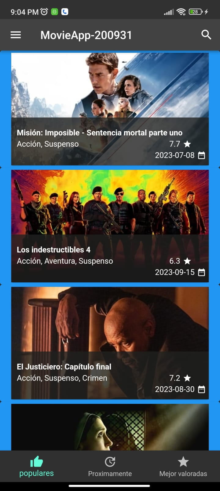
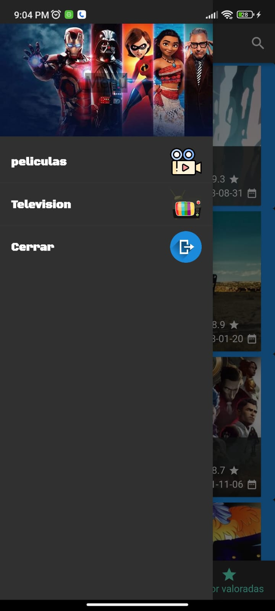
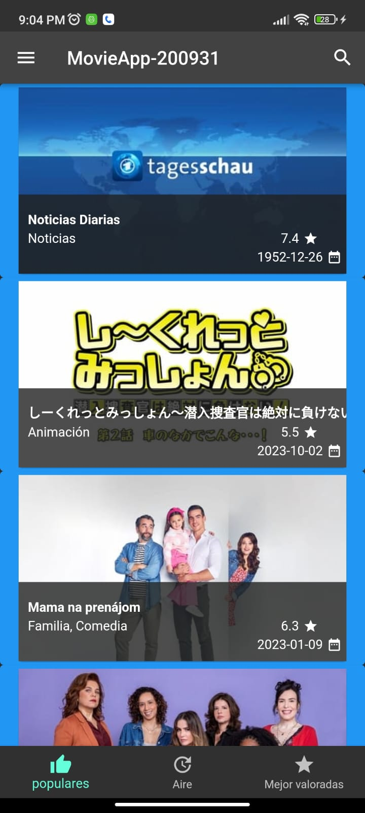
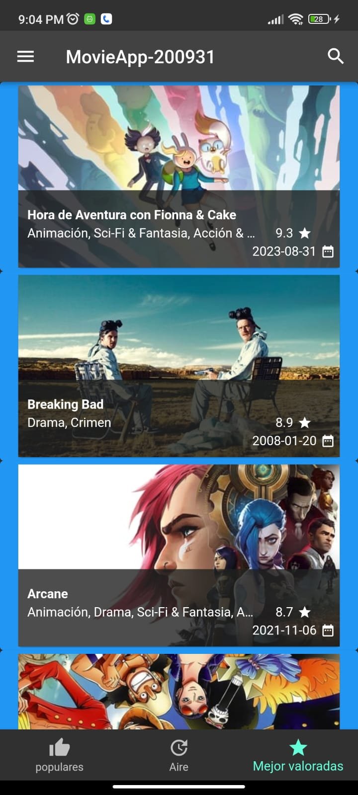

# MovieApp-200931

## Información General

- **Creado por:** Uriel Maldonado Cortez
- **Asignatura:** Desarrollo Movil Integral
- **Grado:** 10
- **Grupo:** A
- **Docente:** MTI. Marco Antonio Ramirez Hernandez

## Descripción del Proyecto

Este proyecto representa una aplicación de muestra desarrollada en Flutter que muestra una página de inicio de la aplicación "MovieApp-200931". La página de inicio contiene los siguientes componentes principales:

### `Home.dart`

Este archivo contiene la clase `Home`, que representa la página de inicio de la aplicación. En el método `initState`, se llama a `_loadJson` para cargar datos de películas utilizando `HttpHandler`. También se define un estilo de fuente personalizado y se crea la estructura principal de la aplicación, que incluye una AppBar, un Drawer y un BottomNavigationBar.

### 1. AppBar (Barra de Navegación Superior)

La AppBar muestra el título "MovieApp-200931" en el centro y un icono de búsqueda en la esquina derecha. Aquí se puede realizar la navegación y realizar búsquedas.

### 2. Menú Lateral (Drawer)

El menú lateral se abre deslizando desde el borde izquierdo de la pantalla o tocando el icono de menú en la AppBar. Contiene las siguientes opciones:

- **"peliculas"**: Una opción que muestra películas y utiliza un estilo de fuente personalizado para dar formato al texto.

- **"Television"**: Una opción que muestra programas de televisión y utiliza el mismo estilo de fuente personalizado.

- **"Cerrar"**: Una opción que permite cerrar el menú lateral y volver a la página de inicio.

### 3. Barra de Navegación Inferior (BottomNavigationBar)

La barra de navegación inferior contiene tres elementos:

- **"populares"**: Muestra películas populares y tiene un ícono de pulgar hacia arriba.

- **"Proximamente"**: Muestra películas próximas a estrenarse y tiene un ícono de actualización.

- **"Mejor valorados"**: Muestra películas mejor valoradas y tiene un ícono de estrella.

En esta Practica del proyeto Hicimos lo soguiente:

### `MEDIA.DART:`
En este archivo, definimos la clase Media, que representa un medio, como una película o programa de televisión. Los atributos de la clase incluyen:

id: Un identificador único para el medio.
voteAverage: La calificación promedio del medio.
title: El título del medio.
posterPath: La ruta del póster del medio.
backdropPath: La ruta de la imagen de fondo del medio.
overview: Una descripción general del medio.
releaseDate: La fecha de lanzamiento del medio.
genreIds: Una lista de identificadores de género asociados al medio.
Además, defines varios métodos en la clase Media, como getPosterUrl(), getBackDropUrl(), getGenres(), y getReleaseYear(), que se utilizan para obtener URLs de imágenes, géneros y el año de lanzamiento del medio.

La clase Media también tiene un constructor de fábrica llamado factory Media, que se utiliza para crear instancias de Media a partir de un mapa JSON.

### `MEDIA_LIST_ITEM.DART:`
En este archivo, definimos la clase MediaListItem, que es un widget de Flutter utilizado para representar elementos individuales de la lista de medios en la página de inicio. Aquí hay una explicación de cómo funciona:

En el constructor de MediaListItem, se pasa un objeto Media como argumento.
El widget Card se utiliza para representar cada elemento de la lista en una tarjeta.
Dentro de la tarjeta, se utiliza FadeInImage.assetNetwork para mostrar una imagen de fondo. Esta imagen se carga desde una URL remota y utiliza una imagen de marcador de posición mientras se carga la imagen principal.
Se agrego un degradado (un fondo gris semi-transparente) encima de la imagen de fondo para hacer que el texto sea más legible.
Se muestra el título del medio (media.title) en la parte inferior izquierda de la tarjeta.
En la parte inferior derecha de la tarjeta, se muestra la calificación (media.voteAverage) y la fecha de lanzamiento (media.releaseDate) del medio.
En resumen, MEDIA_LIST_ITEM.DART define un widget reutilizable llamado MediaListItem que se utiliza para mostrar elementos individuales de la lista de medios con una imagen de fondo, título, calificación y fecha de lanzamiento.

En conjunto, estos archivos forman parte de la interfaz de usuario de la aplicación "MovieApp-200931" y se utilizan para mostrar información detallada sobre las películas o programas de televisión en la página de inicio

## Capturas de Pantalla

  
  
  
  
  
  
  

## Instalación

Para ejecutar esta aplicación en tu entorno de desarrollo, sigue estos pasos:

1. Asegúrate de tener Flutter y Dart instalados en tu sistema.

2. Clona este repositorio o descarga el código fuente.

3. Abre una terminal en la carpeta del proyecto.

4. Ejecuta `flutter pub get` para obtener las dependencias.

5. Ejecuta `flutter run` para iniciar la aplicación en un emulador o dispositivo físico.

Este proyecto es un ejemplo sólido de una página de inicio en Flutter que utiliza elementos de interfaz de usuario personalizados y estilos de fuente únicos. Si tienes alguna pregunta o necesitas ayuda adicional, no dudes en contactar al autor.
